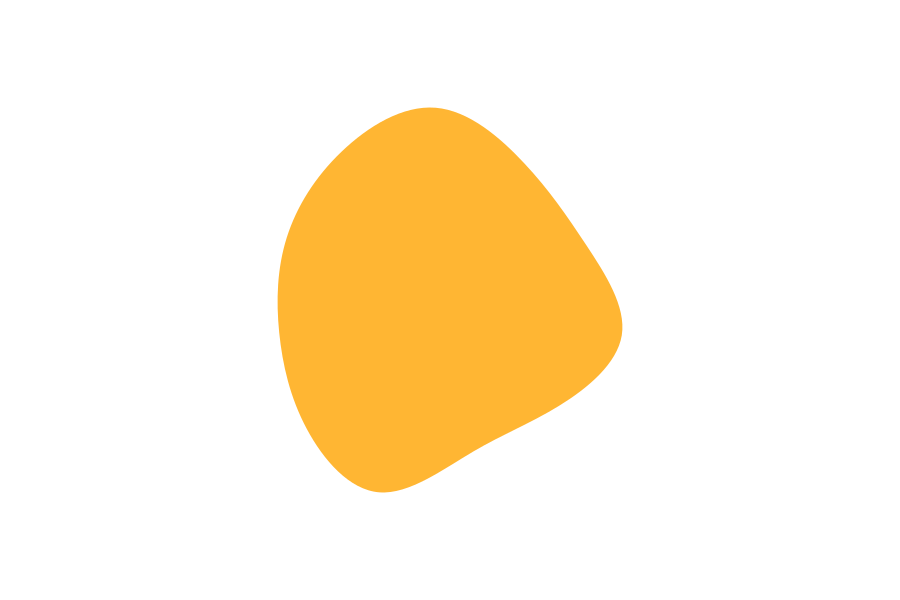

# Make waves and all kind of shapes using SVG online tools

1. Use [Shape Divider App](https://www.shapedivider.app/) to separate sections


2. Use [haikei App](https://haikei.app/) to create all kind of SVG forms: bubbles, waves, gradients, circles ...



# Make waves using CSS, more difficult and the result is not the best

```
.curve::before{
  content: '';
  display: block;
  position: absolute;
  border-radius: 100% 50%;
  width: 55%;
  height: 100%;
  background-color: #202731;
  transform: translate(85%, 60%);
}
.curve::after{
  content: '';
  display: block;
  position: absolute;
  border-radius: 100% 50%;
  width: 55%;
  height: 100%;
  background-color: rgb(77, 77, 216);
  transform: translate(-4%, 40%);
  z-index: -1;
}
```

# Make the shapes to move with JS library

](https://www.jsdelivr.com/package/npm/kute.js)

1. Download 2 SVG from [haikei App](https://haikei.app/)

2. Copy the first SVG in the HTML

3. Insert the second images' <g>...</g> inside the SVG, <g>...</g><g>...</g> they are going to be siblings

4. Write id="first" and id="second"

```
<svg
        id="visual"
        viewBox="0 0 900 600"
        width="900"
        height="600"
        xmlns="http://www.w3.org/2000/svg"
        xmlns:xlink="http://www.w3.org/1999/xlink"
        version="1.1"
      >
        <g transform="translate(437.29480370028955 308.935687909281)">
          <path id="blob1"
            d="M86.9 -145.7C111.5 -119.5 129.4 -93.4 148.8 -64.1C168.2 -34.8 189 -2.3 184.5 26.3C179.9 54.8 150.1 79.5 121.7 96.9C93.3 114.4 66.5 124.7 36.1 142.5C5.8 160.3 -28.1 185.7 -58 183.4C-87.9 181.1 -113.9 151.1 -130.6 119.8C-147.3 88.5 -154.8 55.9 -158.1 23.6C-161.3 -8.7 -160.2 -40.7 -150.5 -71.5C-140.7 -102.3 -122.3 -131.9 -95.7 -157.3C-69.2 -182.7 -34.6 -203.8 -1.7 -201.2C31.2 -198.5 62.4 -172 86.9 -145.7"
            fill="#ffb633"
          ></path>
        </g>
        <!--Copiado el elemento g del SVG de la segunda forma: Ahora tenemos 1 bloque encima de otro bloque-->
        <!--Le vamos a poner un id a cada uno: blob1 y blob2-->
        <g transform="translate(446.77245757854763 308.46149562180705)" style="visibility: hidden">
          <path
          id="blob2"
            d="M129.3 -154C164 -125.1 185.9 -80.9 186.6 -38.6C187.3 3.7 166.8 44.1 145 85.5C123.2 126.8 100.1 169.1 67.7 177.1C35.3 185 -6.4 158.6 -40.6 135.7C-74.8 112.8 -101.5 93.4 -127.4 65.4C-153.4 37.4 -178.6 0.7 -180.1 -38.8C-181.5 -78.4 -159.2 -120.8 -125.3 -149.8C-91.3 -178.8 -45.6 -194.4 0.9 -195.4C47.4 -196.4 94.7 -182.9 129.3 -154"
            fill="#ffb633"
          ></path>
        </g>
      </svg>
```

5. Download [kute.js](https://thednp.github.io/kute.js/) library
6. Write the JS:
  ```
        const tween = KUTE.fromTo(
        '#blob1',
        { path: '#blob1' },
        { path: '#blob2' },
        { repeat: 999, duration: 3000, yoyo: true }
      )

      tween.start()
  ```